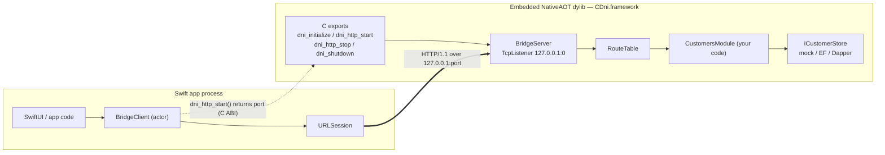
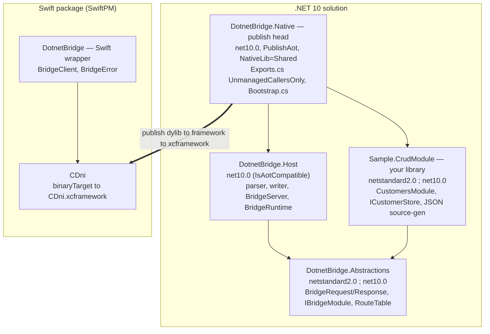
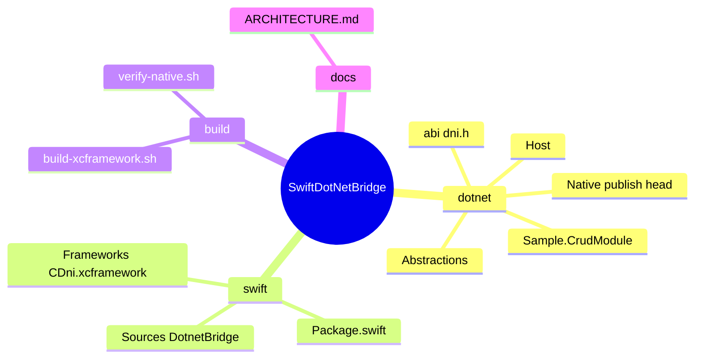
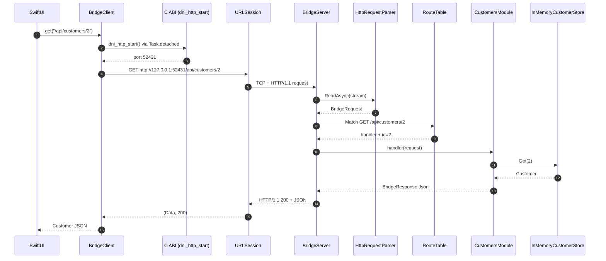
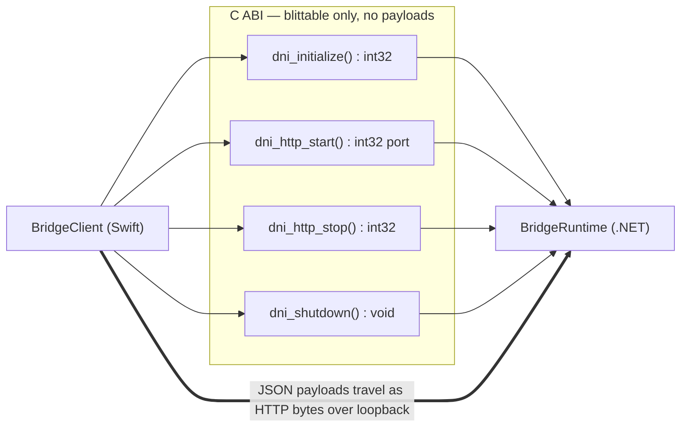
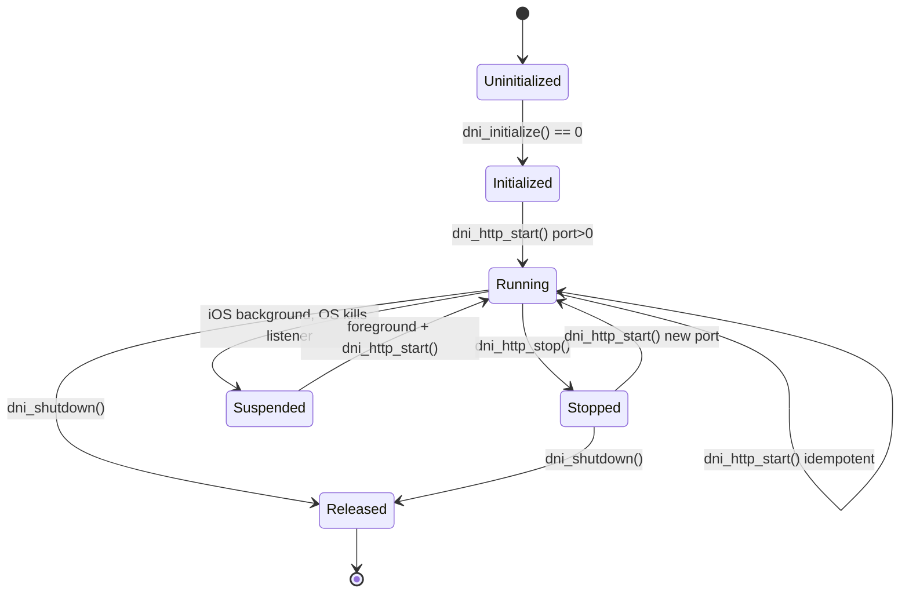
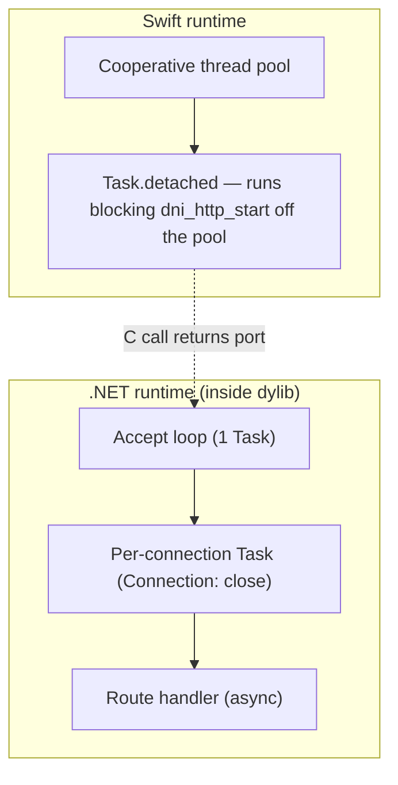
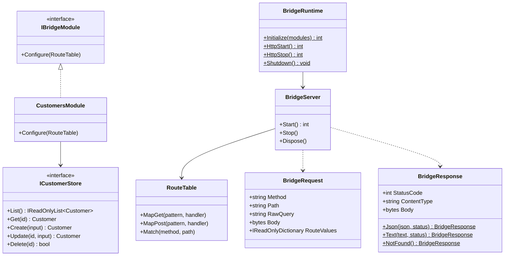
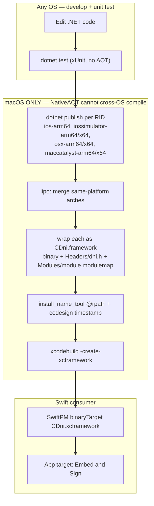

# SwiftDotNetBridge — Architecture

A reusable framework that lets a **Swift app embed a .NET 10 library** and call into it over an
**in-process loopback HTTP server**, shipped as a SwiftPM package wrapping an `.xcframework`.

This document is the deep-dive reference: the *why* behind the design, the moving parts, and the
diagrams that make the data/control flow legible. For step-by-step build/run instructions see the
sibling docs (`mac-build-runbook.md`, `nativeaot-caveats.md`, `INTEROP_CONTRACT.md`).

---

## 1. The problem & the one-paragraph solution

On Apple platforms, .NET runs as a *guest* runtime embedded inside a native (Swift/Obj-C) host
process. There is no ASP.NET hosting model available under NativeAOT on iOS — **Kestrel has no
mobile runtime pack** — so the usual "spin up a web host" approach doesn't apply. The workaround
that *does* work: compile the .NET code to a **NativeAOT shared library**, expose a tiny C ABI to
start a **raw `TcpListener` HTTP/1.1 server bound to `127.0.0.1:0`**, and have Swift talk to it with
`URLSession`. The loopback bind means no Local Network permission prompt, and the C ABI stays
trivially small because **request/response payloads never cross the C boundary — they travel as
HTTP bytes over the socket.**

---

## 2. System context

One OS process. The Swift app and the .NET runtime live together; the "network" call is a loopback
socket that never leaves the device.

---

## 3. Design principles

1. **The C ABI is tiny and blittable.** Four functions, all `int32`/`void`. No strings, no structs,
   no callbacks cross the boundary for the HTTP transport. This is what makes the "C code" provably
   gap-free — there is almost no surface to get wrong.
2. **Payloads ride HTTP, not the ABI.** All JSON/bytes flow over the loopback socket. The bridge
   core never serializes anything, so it can't drag reflection-based JSON into the AOT image.
3. **Business logic is pluggable and portable.** Your code implements `IBridgeModule` and declares
   routes. It can target `netstandard2.0` *or* `net10.0` — so the same library works in the bridge,
   in a server, or in a legacy app.
4. **The data layer is a swappable seam.** Routes call an interface (`ICustomerStore`); the public
   example ships an in-memory mock, production swaps in EF Core/Dapper/an HTTP client — no ABI or
   Swift change.
5. **AOT-clean by construction.** Trimming-safe, no dynamic loading, source-generated JSON,
   `InvariantGlobalization`. Strict analyzers + `TreatWarningsAsErrors` enforce it at the library
   layer, long before the Mac `dotnet publish`.

---

## 4. Components & project layout

Three .NET projects + the user's module, plus a Swift package. The layering exists to satisfy a hard
NativeAOT rule (see §6): **C exports are only emitted from the *published* assembly**, so they must
live in the publish head, not in a referenced library.

| Project | TFM(s) | Role |
|---|---|---|
| `DotnetBridge.Abstractions` | `netstandard2.0;net10.0` | The contract your module implements: `BridgeRequest`, `BridgeResponse`, `IBridgeModule`, `RouteTable`. No P/Invoke, no AOT-only APIs. |
| `DotnetBridge.Host` | `net10.0` (`IsAotCompatible`) | The reusable server engine: HTTP/1.1 parser/writer, `BridgeServer` (TcpListener), `BridgeRuntime` facade. |
| `Sample.CrudModule` | `netstandard2.0;net10.0` | Example "whatever code": Customers CRUD over `ICustomerStore`, source-gen JSON. |
| `DotnetBridge.Native` | `net10.0` + `PublishAot` | The publish head — the **only** place `[UnmanagedCallersOnly]` lives. Emits `dni.dylib`. |
| `swift/` (SwiftPM) | Swift 6 | `binaryTarget` over `CDni.xcframework` + the `BridgeClient` wrapper. |

---

## 5. End-to-end request flow

A `GET /api/customers/2` from Swift, all the way to the mocked store and back. Note the first step:
`BridgeClient` calls `dni_http_start()` (idempotent) to learn the live port before issuing the HTTP
request — this also transparently recovers from an iOS background-suspend that killed the listener.

---

## 6. The C ABI boundary (and why it's gap-free)

The entire native surface, from `abi/dni.h`:

| Export | Signature | Returns | Notes |
|---|---|---|---|
| `dni_initialize` | `int32_t (void)` | `0` or negative | Build routes from registered modules. Idempotent. |
| `dni_http_start` | `int32_t (void)` | port `>0` or negative | Bind `127.0.0.1:0`, start accept loop. Idempotent → cached port. |
| `dni_http_stop` | `int32_t (void)` | `0` | Stop the listener. Safe when not running. |
| `dni_shutdown` | `void (void)` | — | Release the server. Never throws. Call last. |

Status codes: `DNI_OK=0`, `DNI_NOT_INITIALIZED=-1`, `DNI_INVALID_ARGUMENT=-2`,
`DNI_ALREADY_RUNNING=-4`, `DNI_INTERNAL=-5`.

**Two NativeAOT rules this design is built around:**

- *Exports are only emitted from the published assembly* — methods marked `[UnmanagedCallersOnly]`
  in a project reference are **not** exported. That's why `Exports.cs` lives in `DotnetBridge.Native`
  (the publish head), delegating to `BridgeRuntime` in the Host library.
- *`[UnmanagedCallersOnly]` methods must be `static`, non-generic, and take only blittable args.*
  Our four functions are parameterless and return `int`/`void` — the simplest possible surface.

---

## 7. Lifecycle & the iOS suspend rule

The OS tears down the listener when an iOS app is suspended. Because `dni_http_start()` is
idempotent and returns the (possibly new) port, `BridgeClient.ensureStarted()` calls it before every
request — so a foreground-resume silently re-binds and keeps working.

---

## 8. Threading model

- **Swift side:** `dni_http_start()` is a *blocking* C call, so it runs on `Task.detached` to avoid
  starving the Swift cooperative pool. `URLSession` is already async. `BridgeClient` is an `actor`,
  so lifecycle calls are serialized.
- **.NET side:** one accept loop `Task`; each connection gets its own `Task` and is closed after a
  single request (`Connection: close`). Handlers are `async`. `BridgeServer.Start/Stop` are guarded
  by a lock and are idempotent.

---

## 9. Type model (.NET)

---

## 10. The CRUD example (your "whatever code")

The sample module is a realistic REST surface so it doubles as a copy-paste template. Routes map to
an `ICustomerStore`; JSON is handled by a source-generated `JsonSerializerContext` (the only
AOT/trim-safe option).

| Method | Route | Handler → Store | Success |
|---|---|---|---|
| GET | `/health` | — | `200 "ok"` |
| GET | `/api/customers` | `List()` | `200` JSON array |
| GET | `/api/customers/{id}` | `Get(id)` | `200` JSON / `404` |
| POST | `/api/customers` | `Create(input)` | `201` JSON |
| PUT | `/api/customers/{id}` | `Update(id, input)` | `200` JSON / `404` |
| DELETE | `/api/customers/{id}` | `Delete(id)` | `204` / `404` |

**To use it at work:** implement `ICustomerStore` against your real datastore and register your
module in `Bootstrap.cs`. Nothing else changes — not the ABI, not the Swift wrapper.

---

## 11. Build & distribution pipeline

NativeAOT **cannot cross-OS compile**, so the dylib/xcframework must be built on macOS. Everything
left of the `dotnet publish` step (editing + unit tests) runs on any OS.

**Why a `.framework`, not a bare dylib:** a raw `.dylib` inside an `.xcframework` is only valid for
macOS dynamic linking; **iOS requires a `.framework` bundle**. Each bundle carries the binary,
`Headers/dni.h`, and `Modules/module.modulemap` (which declares `module CDni`, enabling
`import CDni` from Swift — bridging headers don't work in SwiftPM library targets).

---

## 12. The .NET 10 + .NET Standard split (clarified)

- The **runtime host** (`DotnetBridge.Native`) is **.NET 10 + NativeAOT** — the only thing that can
  emit a native library. This is non-negotiable and is what produces the dylib.
- "Support both" applies to the **portable contract** your business logic references
  (`DotnetBridge.Abstractions`) and your module — they multi-target `netstandard2.0;net10.0`. So a
  `netstandard2.0` library can plug into the bridge unchanged, and the same code can also be consumed
  by servers, desktop apps, or older runtimes.
- NativeAOT can *consume* a `netstandard2.0` dependency; it just can't *be* `netstandard`.

---

## 13. Security & footprint notes

- **Loopback only.** The listener binds `127.0.0.1`, so it's unreachable off-device and triggers no
  iOS Local Network permission prompt.
- **Ephemeral port.** Bind to port `0`; the OS assigns a free port returned to Swift. No fixed-port
  collisions, no privileged ports.
- **No reflection / no dynamic code.** NativeAOT forbids `Reflection.Emit` and assembly loading;
  combined with source-gen JSON this also hardens the attack surface.
- **Signed binary.** The xcframework is `install_name`-fixed to `@rpath`, re-signed
  (`codesign --timestamp`), and embedded with "Embed & Sign". Bitcode is gone (deprecated since
  Xcode 14).

---

## 14. Extension points

- **Add an endpoint:** add a `routes.MapX(...)` in your module — no ABI/Swift change; rebuild the
  xcframework.
- **Swap the datastore:** implement `ICustomerStore` (or your own interface) — mock for tests,
  real DB for production.
- **Add a module:** implement `IBridgeModule` and add it to `Bootstrap.Modules()`.
- **A future FFI/streaming transport** (callbacks, returned C strings) would reintroduce string
  marshalling and `@convention(c)` + `Unmanaged` callback bridging — documented in
  `INTEROP_CONTRACT.md` as an appendix, but intentionally *not* part of the HTTP transport.

---

## 15. Where to go next

- `mac-build-runbook.md` — building the xcframework on the Mac (SSH, keychain unlock, device deploy).
- `nativeaot-caveats.md` — the full list of AOT gotchas and how this design avoids each.
- `INTEROP_CONTRACT.md` — the frozen ABI contract + the FFI-transport appendix.
- The implementation plan: `docs/superpowers/plans/` (or the workspace plan file) — task-by-task code.
